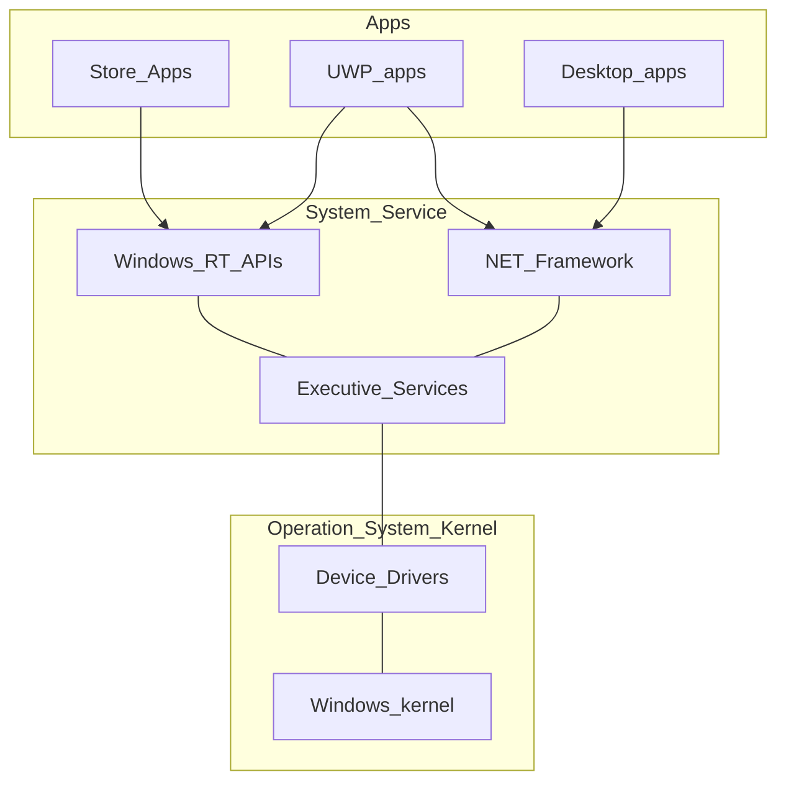
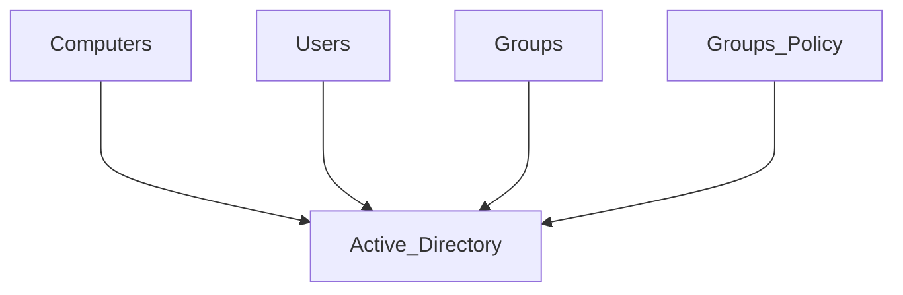

- Apps
- [[System Service]]
- Operating System Kernel

```ad-note
title: Driver

Library that instructs the kernel on service usage. Usually digitally signed through [Hashing](#Hashing), for latest devices.
```


Drivers are **architecture** specific:

- x86 drivers
- x64 drivers

Divided into:

- Setup information (.inf)
- DLLs (.sys)
- Catalogue (.cat)

The CPU architecture is determined by the type of **assembler** used.

```ad-note
title: Assembler

Low level language between High Level Language (compiler) and Machine Language (binary)
```

## Checking Hardware

Microsoft Assessment and Planning Toolkit (MAP) is a software that:
- Scans the network
- Locates all the computers on the network
- Checks hardware compatibility with Win 10
- Requires no agent on any client

## Active Directory
#TODO



# Hashing and Encryption

## Hashing

Mathematical irreversible function of substitute an input in an output.

## Encryption

- **Symmetric**: requires a decryption key for each session
- **Asymmetric**: requires 2 keys for each user (a public one and a private one). The public one (receiver) is used to encrypt data sent to the receiver, the receiver then uses the private one (receiver) to de-encrypt the data.

# Partitions & Volumes

## Partition

Division of a single disk into multiple sectors.

- **Master Boot Record (MBR)**: Counts from the beginning of the disk.
- **Guide Partition Table (GPT)**: More recent and reliable. Only for Win x64 e UEFI.

## Volume

Memory allocation visible to the computer. A volume can include multiple partitions.

It need to be formatted -> archive method defined by the file system

## Disk Manager

Tool to manage the disks, volumes and partitions.
